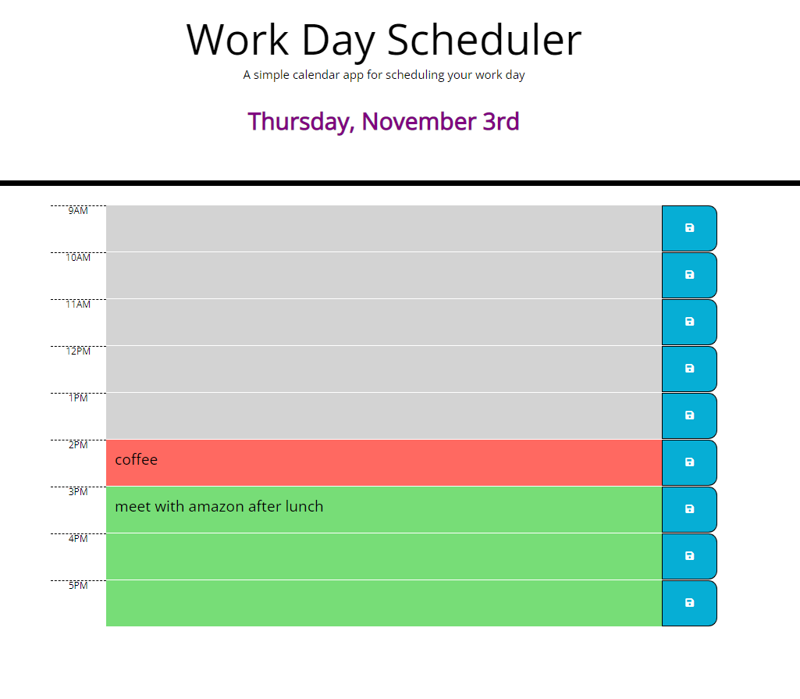

# Week-5-Challenge-Work-Day-Scheduler

## Description
This week's challenge was to create a work day scheduler that was colour coded for past present and future time blocks, with the function of writing a description and saving that to local storage. The page should then be able to load the saved data from local storage and keep it on the page.

## Screenshot

## Deployed Link
https://tiiingaling.github.io/Week-5-Challenge-Work-Day-Scheduler/

